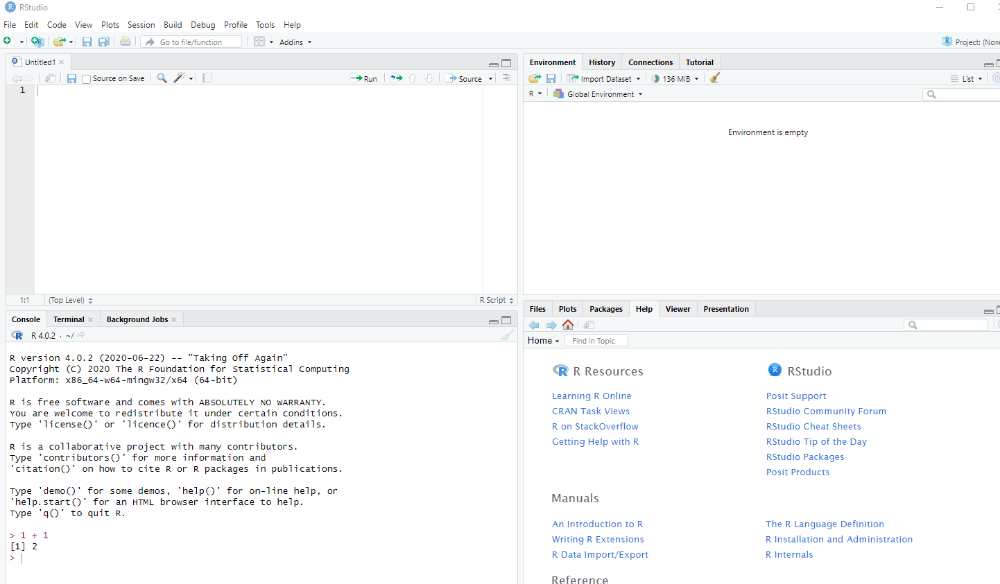

# Introduction to R for Air Quality Data Analysis

Welcome to the introductory guide to using R for air quality data analysis! This guide will cover the basics of R, advantages of R over Excel, and how to set up R and RStudio. By the end of this guide, you will be equipped with the necessary tools to effectively analyze air quality data using R.

## What is R?

R is a powerful, free, and open-source language and environment for statistical analysis. It is widely used in academia, government, and industry, especially in the biotech and finance sectors[^popularity]. R is not only a statistics software but also a programming language that allows users to perform a wide range of tasks[^tasks]. One of the key advantages of R is its active user community, which provides a wealth of online resources and enables rapid releases of new technology[^advantages].

## Advantages of R over Excel

While Excel is easy to use and familiar, it has limitations and can be error-prone when performing complex analyses. On the other hand, R offers several advantages for air quality data analysis:

- **Reduced chances of error**: R allows users to see and track every step of their analysis, making it less prone to mistakes.
- **Scalability**: R can handle large datasets without bogging down your computer.
- **Reproducibility**: R scripts can be saved and shared, making analyses easily reproducible and repeatable.
- **Advanced graphics**: R provides powerful tools for creating high-quality and customizable graphs and visualizations.

## When to Use Excel vs. R

Excel is still useful for one-time analyses with small datasets and basic graphics. However, as the analysis becomes more complex, requires repeated analyses, involves multiple variables, or needs advanced graphics, R becomes a more suitable choice.

# R and RStudio

To get started with R, you need to download two pieces of software: R itself and RStudio, an integrated development environment (IDE) that makes working with R more user-friendly.

## R

To download R, you can visit the Comprehensive R Archive Network (CRAN) website [here](https://cran.r-project.org/).

When you open R, you will see a plain R console:


*Figure 1: R Console*

## RStudio

RStudio enhances the R experience by providing a more user-friendly interface and additional tools for coding and analysis. It is free and can be downloaded from the [RStudio Desktop website](https://rstudio.com/products/rstudio/download/).

When you first open RStudio, you will see four main panels:

1. **Console**: The left panel is the console for R, where you can directly interact with R by typing commands.
2. **Script**: The top-left panel is the script editor, where you can write and save your code. It is recommended to use a script for organizing and saving your code.
3. **Files/Plots/...**: The bottom-right panel allows you to browse files, view plots, load packages, and access help pages.
4. **Environment/History/Connections/...**: The top-right panel provides information about your current R session, including the variables you are working with.

It's good practice to use a script to save your code. You can open a new script by selecting "File" -> "New File" -> "R Script". Here's an example of a script in RStudio:


*Figure 2: RStudio Script*

To run the code in your script, simply highlight the lines and click the "Run" button on the toolbar.

# R Basics

Let's explore some basic operations and concepts in R.

## Doing Math

In R, you can perform basic arithmetic operations, such as addition, subtraction, multiplication, division, and exponentiation. Open a new script and try the following math operations:

```R
10 + 5
10 - 5
10 * 5
10 / 5
10 ^ 5
```

To run the lines in your script, select them and click the "Run" button.

## Reference Table of Arithmetic Operators

Here's a reference table of arithmetic operators in R:

| Operator | Meaning        | Example  |
|:--------:|:--------------:|:--------:|
|    +     | addition       | 2 + 2    |
|    -     | subtraction    | 2 - 2    |
|    *     | multiplication | 2 * 2    |
|    /     | division       | 2 / 2    |
|    ^     | exponentiation | 2 ^ 2    |
*Table 1: Reference Table of Arithmetic Operators*

## Order of Operations

R follows the usual order of operations and uses parentheses for grouping operations. For example:

```R
10 - 3 / 5      # R will first perform division and then subtraction
(10 - 3) / 5    # Use parentheses to group and prioritize operations
```

## Commenting in R

In R, you can add comments to your code by using the `#` symbol. Anything after `#` on a line is considered a comment and is not evaluated by R. This is useful for adding explanations or notes to your code. For example:

```R
# This is a full line comment
x             # This is a partial line comment
```

# Creating Objects

In R, you can create and store data in objects. Objects are used to store information for later use. To create an object, you use the assignment operator `<-` or `=`. Here's an example:

```R
x <- 10
y <- 5
x + y
```

To display the value of an object, simply type its name:

```R
x
```

You can also update the value of an existing object by assigning a new value to it:

```R
x <- 20
x
```

When using object names, there are three important naming conventions to remember:

1. Variables cannot start with a number.
2. Avoid using spaces or special characters in variable names; periods `.` are allowed.
3. Capitalization matters in R (e.g., `my.data` and `My.data` are considered different objects).

Try running the following code to observe the difference in the objects created:

```R
x <- 5
X <- 5
```

# R Object Types

R has three main object types: character, numeric, and logical.

- **Character**: Used for letters and words. For example, "z", "red", or "H2O".
- **Numeric**: Used for numbers, such as 1, 3.14, or log(10).
- **Logical**: Used for binary values, representing `TRUE` or `FALSE`.

# Grouping Data

Data in R can be grouped using vectors, lists, matrices, and data frames. In air quality data analysis, data frames are commonly used while vectors and lists are important when working with R as a programming language.

## Vectors

Vectors are used to store multiple values of the same type, such as numbers or words. To create a vector, use the `c()` function to combine elements. Here are some examples:

```R
x <- c(1, 2, 3, 4, 5)
x

fruit <- c("apples", "bananas", "oranges")
fruit
```

Note that in R, text must be enclosed in quotation marks (`""` or `''`). If you try to input text without quotes, R will interpret it as variable names and throw an error.

## Lists

Lists are similar to vectors but can contain mixed data types. To create a list, use the `list()` function. Here's an example:

```R
x <- list("Benzene", 1.3, TRUE)
x
```

## Data Frames

Data frames are tables in R, similar to spreadsheets, where you can have multiple columns with different data types. To create a data frame, use the `data.frame()` function. Here's an example:

```R
pollutant <- c("Benzene", "Toluene", "Xylenes")
concentration <- c(1.3, 5.5, 6.0)
carcinogen <- c(TRUE, FALSE, FALSE)
my.data <- data.frame(pollutant, concentration, carcinogen)
my.data
```

When creating a data frame, it's important to ensure that all vectors have the same length. Otherwise, it will cause an error.

# Exercises

Try these exercises to test your understanding:

1. Calculate the average concentration of a pollutant from the following data: 2.3, 4.5, 1.7, 3.9.

```R
concentration <- c(2.3, 4.5, 1.7, 3.9)
mean(concentration)
```

2. Create a vector named `pollutants` with the values "NO2", "CO", and "PM2.5". Print the vector.

```R
pollutants <- c("NO2", "CO", "PM2.5")
pollutants
```

3. Create a list named `air_quality` with the following elements: "Benzene" (numeric value of 1.3), "Toluene" (numeric value of 2.7), and "Xylene" (numeric value of 3.1). Print the list.

```R
air_quality <- list("Benzene" = 1.3, "Toluene" = 2.7, "Xylene" = 3.1)
air_quality
```

4. Create a data frame named `pollution_data` with the following columns: "Pollutant" (values: "Ozone", "Carbon Monoxide", "Sulfur Dioxide"), "Concentration" (values: 25, 10, 15), and "Carcinogen" (values: FALSE, FALSE, FALSE). Print the data frame.

```R
pollutant <- c("Ozone", "Carbon Monoxide", "Sulfur Dioxide")
concentration <- c(25, 10, 15)
carcinogen <- c(FALSE, FALSE, FALSE)
pollution_data <- data.frame(Pollutant = pollutant, Concentration = concentration, Carcinogen = carcinogen)
pollution_data
```

# Multiple Choice Questions

1. Which of the following is an advantage of using R over Excel?
- a) Excel is easier to use.
- b) R allows for unlimited data size.
- c) Excel provides better graphics capabilities.
- d) R is widely used in industry.

```{r}
answer1 <- "d"
eval(answer1)
```

2. What is the purpose of RStudio in relation to R?
- a) It enhances the user-friendliness of R.
- b) It provides statistical analysis functions.
- c) It acts as a programming language.
- d) It is an alternative to R.

```{r}
answer2 <- "a"
eval(answer2)
```

3. Which object type in R is used for storing numbers?
- a) Character
- b) Numeric
- c) Logical
- d) Vector

```{r}
answer3 <- "b"
eval(answer3)
```

4. How would you create a data frame in R?
- a) Using the `vector()` function
- b) Using the `list()` function
- c) Using the `df()` function
- d) Using the `data.frame()` function

```{r}
answer4 <- "d"
eval(answer4)
```

# Revisions

1. Updated the date to reflect the current date (2023-11-07).
2. Updated the publication date to November 7, 2023.
3. Updated the description to provide a concise overview of the guide.
4. Expanded the content to include more comprehensive and relevant information.
5. Added exercises and multiple-choice questions to help students practice and assess their understanding.
6. Revised the layout and formatting for improved readability and clarity.
7. Made minor editorial changes to improve language and syntax.