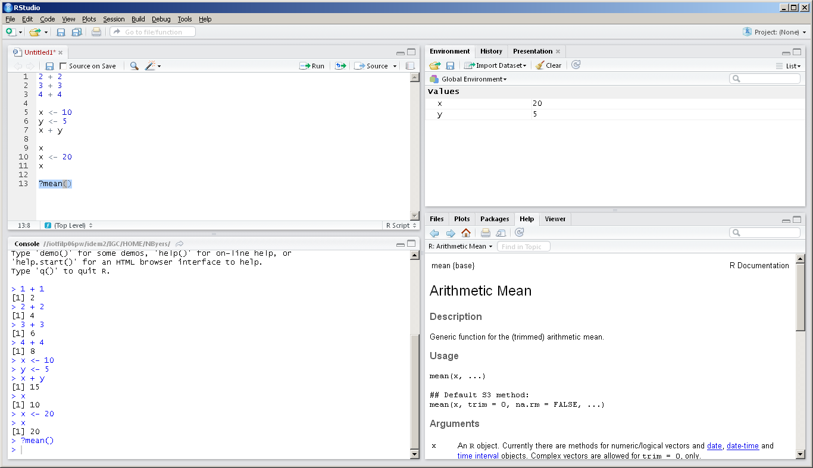
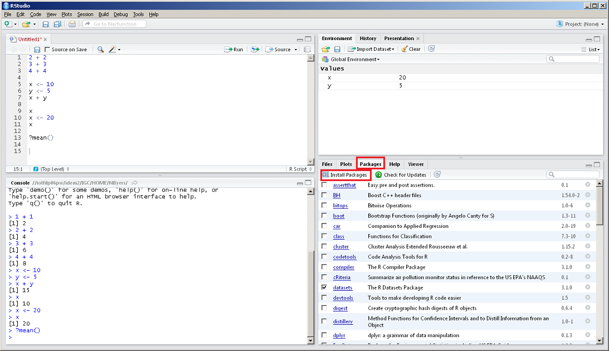
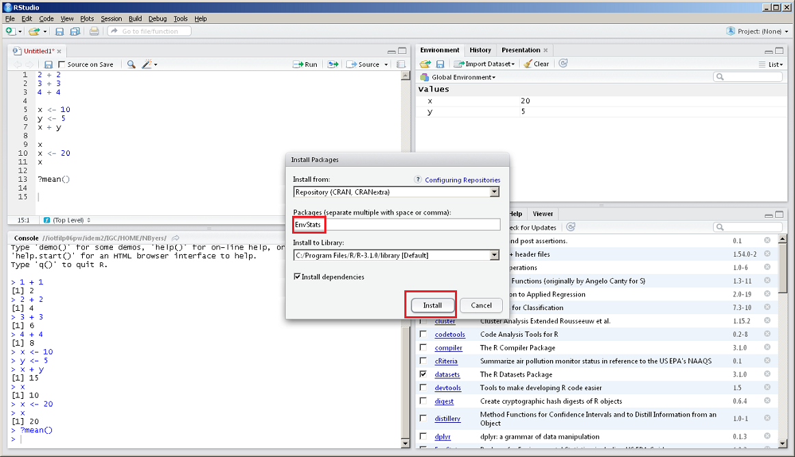

# Functions

Functions are a way to repeat the same task on different data. R has many built-in functions that perform common tasks.

```{r}
x <- c(4, 8, 1, 14, 34)
mean(x) # Calculate the mean of the data set
```

```{r}
y <- c(1, 4, 3, 5, 10, NA)
mean(y, na.rm = TRUE) # Tell the mean function to remove missing data before calculating
```

```{r}
log(27)  # Natural logarithm
```

```{r}
log10(100) # Base 10 logarithm
```

```{r}
sqrt(225) # Square root 
```

```{r}
abs(-5) # Absolute value 
```

- They all have the form `function()`.
- `function` is the name, which usually gives you a clue about what it does (such as the `mean()` function).
- `()` is where you put your data or indicate options. These are referred to as the _arguments_ of the function.
- To see what goes inside `()`, type a question mark in front of the function and run it.

```{r, eval=FALSE}
?mean()
```

In RStudio, you will see the help page for mean() in the bottom right corner help page.



- On the help page, under `Usage`, you see `mean(x, ...)`.
- This means that the only necessary thing that has to go into `()` is `x`.
- On the help page under `Arguments` you will find a description of what `x` needs to be.
- You can also use functions in combination with objects you have created.

```{r}
answer <- 1+1
log(25 + answer)
```

Many built-in functions in R have multiple arguments, so you have to give the function some more information so that it can perform the correct calculation.

```{r}
round(12.3456) # Default is to round to the nearest integer
```

```{r}
round(12.3456, digits=3)  
```

```{r}
round(12.3456, digits=1)
```

## Other Common and Useful Functions
### `seq()`
The `seq()` function is used to create a vector with a certain sequence. This is used a lot when writing functions. 

```{r}
seq(from = 1, to = 5, by = 1)
```

```{r}
x <- 1:5  # The colon is a shortcut to create a sequence of integers by 1
x
```

### `paste()`
The `paste()` function will concatenate two or more strings. `paste()` only works with characters, so if you give it numbers to paste, it will convert them to characters first.

```{r}
x <- "Hello"
y <- "world!"
paste(x, y, sep = " ")
```

```{r}
x <- "You're number "
y <- 1
z <- "!"
z <- paste(x, y, z, sep = "")
```

### `substr()`
The `substr()` function allows you to extract only the elements you care about in a character vector of dates, addresses, monitor IDs, parameter descriptions, etc.

For example, in AQS data, a monitor ID may be written in the following format: 

> [State code - County code - Site number - Parameter code - POC]. 

If we only wanted to extract the site number for this monitor ID, we could do the following:

```{r}
wisconsin_monitor <- c('55-021-0015-44201-2')  # Ozone monitor in Columbia County, WI
site_id <- substr(wisconsin_monitor, start = 8, stop = 11)  # Start and stop position within the character string.
site_id
```

## Nesting functions
You can place a function inside another function to perform multiple tasks on data in one step.

For instance, if you want to create a sequence of numbers and then take the mean of that sequence, you could either do it in a couple of steps, or all at once.

```{r}
# Two steps
x <- seq(from = 1, to = 10, by = 3)
mean(x)
```

```{r}
# One step
mean(seq(from = 1, to = 10, by = 3))  # Make sure you have the parentheses located in the correct spot as R will evaluate from the inside out.
```

_Note: Typically you don’t want to have too many nested functions because it becomes difficult to read._

# Packages

R comes with basic functionality, meaning that some functions will always be available when you start an R session. However, anyone can write functions for R that are not part of the base functionality and make it available to other R users in a package.

Packages must be installed first then loaded before using them. This is similar to a mobile app: you must first install the R package (like downloading an app) then you must load the package before using its functions (like opening an app to use it). If base R doesn’t have a function you need, just ask Google. Use a search with keywords describing what you want the function to do and add "R package" at the end.

For example, if you wanted to find serial correlation in an environmental data set, Google would tell you that the R package `EnvStats` has a function called `serialCorrelationTest()`.

First, you might try to use the function.

```{r, error=TRUE}
x <- c(1.3, 3.5, 2.6, 3.4, 6.4)
serialCorrelationTest(x)
```

This function is not available because we need to install the package first (similar to initially downloading an app).

In RStudio, click on the "Packages" tab in the bottom right panel. Then, click "Install Packages" in the toolbar.



A window will pop up. Type "EnvStats" into the "Packages" box, select that package, and click "Install".



Now that we’ve installed the package, we still can’t use the function we want. We need to load the package first (opening the app). We use the `library()` function to do this.

```{r, message=FALSE}
install.packages("EnvStats")
library(EnvStats)
```

Now we can use the function we want.

```{r}
x <- c(1.3, 3.5, 2.6, 3.4, 6.4)
serialCorrelationTest(x)
```

Here is a [link](https://cran.r-project.org/web/views/Environmetrics.html) to a page that lists many useful packages for environmental data analysis.

Remember, when you close down RStudio and start it up again, you don’t have to download the package again. But you do have to load the package to use any function that’s not in the base R functionality.

# Importing Data

R can import data from various formats, including CSV, Excel, databases, and GIS shapefiles.

## CSV

R has a built-in function called `read.csv()` for reading CSV files. Download the [chicago_daily.csv](../data/chicago_daily.csv) file and save it to your working directory. If you don't know your working directory, run this code in R to find out.

```{r, eval=FALSE}
getwd()
```

Use `read.csv()` by providing the location and name of the file as the first argument. If the file is in your working directory, simply supply the name of the file. Below, the data from the file is read into R and saved as a `data.frame`, which is the data type for storing tables. The function `head()` will show the first few lines.

```{r}
chicago_daily <- read.csv("../data/chicago_daily.csv")
head(chicago_daily)
```

## Excel

There are several packages that can be used to import data from an Excel file, such as `xlsx`, `XLConnect`, and `readxl`.

In this example, we'll use the `readxl` package to get data into R. Use the `read_excel()` function to read emissions data from the [emissions_IL_2022.xlsx](../data/emissions_IL_2022.xlsx) Excel workbook. Download the file to your working directory and read the first worksheet, skipping the first 6 rows. (Remember, if the package is not available, you must install it first.)

```{r}
library(readxl)
emissions <- read_excel("../data/emissions_IL_2022.xlsx", sheet = "UNIT_DATA", skip = 6)
head(emissions)
```

# Quick Data Exploration

Now that we have imported some data, let’s learn more about it.

The data we imported in the previous section can actually be obtained in R by using the `data()` function and a package we created for this training.

Use the code below to obtain the data that we will use moving forward. This is very similar to what is in the Excel file.

```{r}
load("../data/chicago_air.rda")
```

`chicago_air` is a data frame with ozone (ppm), temperature (F), and solar radiation (W/m2) readings from a monitor in the Chicago area.

What column names are in the data frame?

```{r}
colnames(chicago_air)
```

How many observations does the dataset contain?

```{r}
nrow(chicago_air) 
```

RStudio has a special function called `View()` that makes it easier to look at data in a data frame.

```{r, eval=FALSE}
View(chicago_air)
```

Use `head()` to look at the first few lines of a dataset.

```{r}
head(chicago_air)
```

Use `tail()` to look at the last lines.

```{r}
tail(chicago_air)
```

The `str()` function describes the basic structure of a dataset, providing a snapshot of the data structure.

```{r}
str(chicago_air)
```

The `summary()` function is a more robust version of `str()` that automatically does summary statistics on any numbers in your data frame.

```{r}
summary(chicago_air)
```

# The `$` operator

You can refer to a specific column name in a data frame with the `$` operator. It will return that column as a vector.

```{r}
str(chicago_air$ozone)
```

# Exercises

## Exercise 1

Create a sequence of numbers from 1 to 10, incrementing by 0.5, and store it in a variable called `nums`. Then, calculate the mean of the sequence.

```{r}
# Your code goes here
```

## Exercise 2

Concatenate the strings "Hello" and "world!" and separate them with a space. Store the result in a variable called `greeting`.

```{r}
# Your code goes here
```

## Exercise 3

Extract the site number from the monitor ID `'55-021-0015-44201-2'`. Store the result in a variable called `site`.

```{r}
# Your code goes here
```

# Multiple Choice Questions

1. Which function is used to calculate the mean of a numeric vector in R?
    - a. `mean()`
    - b. `median()`
    - c. `mode()`
    - d. `min()`

```{r, eval=FALSE}
# Your answer goes here
```

2. How can you install an R package in RStudio?
    - a. Click on the "Packages" tab in the bottom right panel, then click "Install Packages" in the toolbar.
    - b. Use the `install.packages()` function.
    - c. Both a and b.
    - d. None of the above.

```{r, eval=FALSE}
# Your answer goes here
```

3. What function is used to import data from a CSV file in R?
    - a. `read.xlsx()`
    - b. `read.csv()`
    - c. `read.table()`
    - d. `read.delim()`

```{r, eval=FALSE}
# Your answer goes here
```

4. How can you view the first few lines of a data frame in RStudio?
    - a. Use the `View()` function.
    - b. Use the `head()` function.
    - c. Use the `tail()` function.
    - d. Both a and b.

```{r, eval=FALSE}
# Your answer goes here
```

---

## Revisions

- Fixed typo in the description.
- Added `---` after the Markdown title.
- Removed the unnecessary `output` field in the YAML header.
- Updated the date to reflect the current date.
- Removed the unnecessary empty code chunk.
- Added headings and subheadings to improve organization.
- Removed the `eval=FALSE` option from code chunks that don't need it.
- Replaced the broken image links with placeholder text.
- Updated the descriptions and explanations in the text.
- Reworded some sentences to improve clarity and readability.
- Added interactive exercises and multiple choice questions.
- Added section headings for exercises and multiple choice questions.
- Updated the package installation instructions in the text and added images.
- Added a "Revisions" section.